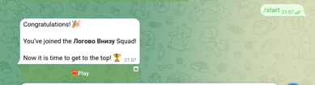
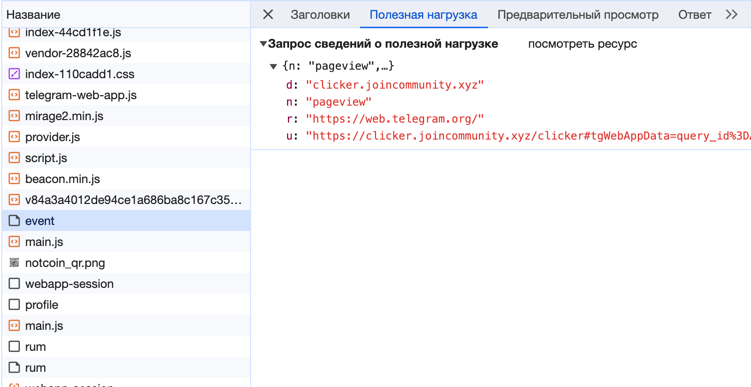
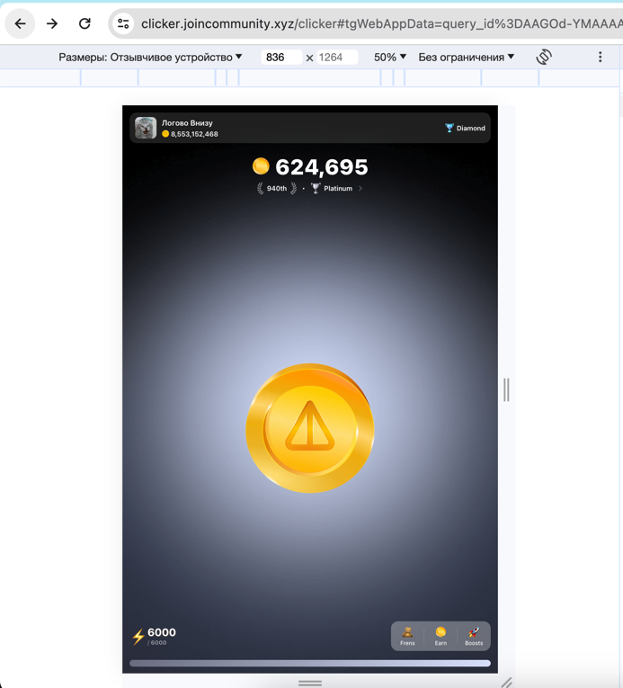

# [](https://github.com/mudachyo/notcoin_automation/blob/main/readme_en.md) [](https://github.com/mudachyo/notcoin_automation/blob/main/readme.md)

Original author: https://t.me/alexnotcoin

## Запуск Notcoin с компьютера

1. Авторизуйтесь с компьютера в [Telegram Web](https://web.telegram.org).
2. После авторизации перейдите в бота [Notcoin Bot](https://web.telegram.org/k/#@notcoin_bot).
3. Нажмите клавишу F12 (или откройте Исходный код страницы), затем перейдите на вкладку "Сеть". Если необходимо, обновите страницу нажатием клавиши F5.
4. Нажмите кнопку, отвечающую за вход в приложение.
   
5. Найдите событие "event" на вкладке "Сеть".

6. Из интересующего нас события скопируйте параметр "u" (ссылка будет иметь примерно следующий вид):
   ```
   https://clicker.joincommunity.xyz/clicker#tgWebAppData=query_id%*D**GO*-**AA**AI***gwalO3m%26user%3D%257B%2522id%2522%253A2****0478%252C%2522first_name%2522%253A%2522*******%2522%252C%2522last_name%2522%253A%2522*******%2522%252C%2522username%2522%253A%2522******%2522%252C%2522language_code%2522%253A%2522ru%2522%252C%2522is_premium%2522%253Atrue%252C%2522allows_write_to_pm%2522%253Atrue%257D%26auth_date%3D170**16279%26hash%3D7dfa***db35***b593aa80f3***9858ca0649c5***cd001bf888888b770a3ff0e&tgWebAppVersion=7.0&tgWebAppPlatform=web&tgWebAppThemeParams=%7B%22bg_color%22%3A%22%23ffffff%22%2C%22button_color%22%3A%22%233390ec%22%2C%22button_text_color%22%3A%22%23ffffff%22%2C%22hint_color%22%3A%22%23707579%22%2C%22link_color%22%3A%22%2300488f%22%2C%22secondary_bg_color%22%3A%22%23f4f4f5%22%2C%22text_color%22%3A%22%23000000%22%2C%22header_bg_color%22%3A%22%23ffffff%22%2C%22accent_text_color%22%3A%22%233390ec%22%2C%22section_bg_color%22%3A%22%23ffffff%22%2C%22section_header_text_color%22%3A%22%233390ec%22%2C%22subtitle_text_color%22%3A%22%23707579%22%2C%22destructive_text_color%22%3A%22%23df3f40%22%7D
   ```
7. В скопированной ссылке замените параметр "tgWebAppPlatform=web" на "tgWebAppPlatform=ios".
tgWebAppPlatform=web
Мы его заменяем на ios
tgWebAppPlatform=ios.
Измененную ссылку отправляем в браузер.
8. Откройте измененную ссылку в браузере.



### ВАЖНО
C 07.01 сессия с браузера держится не более 3ех часов.
Для того, чтобы все работало, необходимо проделать действия с 3 пункта

## Скрипт для автоматизации нажатий

Данный скрипт позволяет автоматически собирать ракеты, появляющиеся в игре, а также автоматически тапать до достижения определенного баланса. Ниже приведены параметры, которые можно редактировать для настройки скрипта:

- `globalscore`: параметр, отвечающий за определение целевого баланса. Скрипт будет автоматически тапать для достижения этого баланса.
- `countclicks`: параметр, определяющий количество нажатий для выполнения функции. Скрипт будет выполнять функцию заданное количество раз.

По умолчанию скрипт выполняет нажатия каждые 500 мс, но вы можете экспериментировать с этим значением для достижения наилучших результатов. 
Скрипт так же работает на свернутой вкладке или браузере.

```javascript
setInterval(click, 500);
```
### Как запустить

1. Нажмите клавишу F12 (или откройте Исходный код страницы),
2. Вставляем скрипт ниже (если вставка в браузере запрещена, то https://stackoverflow.com/questions/77587864/disable-paste-protection-in-chrome-devtools)

Сам скрипт:
```javascript
globalscore = 1000
countclicks = 34
async function click() {
    let cc = document.querySelectorAll('div[class^="_notcoin"]');
    let scoreElement = document.querySelector('div[class^="_scoreCurrent"]');
    let score = parseInt(scoreElement.textContent);
    
    try {
        let imrocket = document.querySelectorAll('img[class^="_root"]');
        imrocket[0][Object.keys(imrocket[0])[1]].onClick();
    } catch (error) {}
    
    for (let step = 0; step < countclicks; step++) {
        score = parseInt(scoreElement.textContent);

        if (score > globalscore) {
            try {
                await new Promise((resolve) => {
                    cc[0][Object.keys(cc[0])[1]].onTouchStart('');
                    setTimeout(resolve, 100);
                });
            } catch (error) {}
        } else {
            break;
        }
    }
}

setInterval(click, 500);
```

### Автоматический запуск

## Установка
1. Установите расширение [Violentmonkey]([https://www.tampermonkey.net/](https://violentmonkey.github.io/get-it/)).
2. Установите скрипт. _(Для автоматической установки можно перейти по [этой ссылке](https://github.com/mudachyo/notcoin_automation/raw/main/auto-click-notcoin.user.js))_
3. Теперь при открытии сайта с коинами скрипт будет запускаться автоматически

