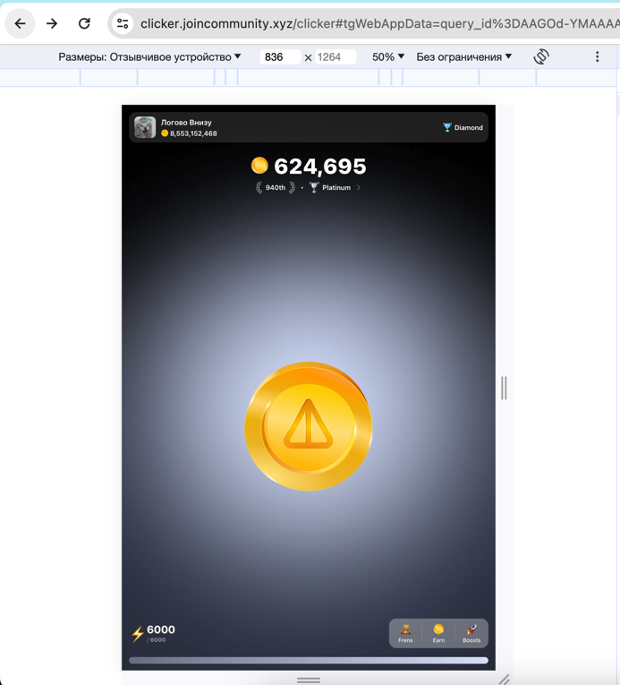

# [](https://github.com/mudachyo/notcoin_automation/blob/main/readme_en.md) [](https://github.com/mudachyo/notcoin_automation/blob/main/readme.md)

Original author: https://t.me/alexnotcoin

## Start Notcoin from a computer

1. log in to [Telegram Web](https://web.telegram.org) from your computer.
2. After authorization, go to [Notcoin Bot](https://web.telegram.org/k/#@notcoin_bot).
3. Press F12 (or open the Source Code of the page), then click the Network tab. If necessary, refresh the page by pressing the F5 key.
4. Press the button responsible for logging into the application.
   
5. Find the "event" event on the Network tab.

6. From the event we are interested in, copy the "u" parameter (the link will look something like the following:)
   ```
   https://clicker.joincommunity. xyz/clicker#tgWebAppData=query_id%*D**GO*-'' **AA**AI***gwalO3m%26user%3D%257B%2522id%2522%253A2****0478%252C%252[2first_name%2522%253A%2522*******%2522%252C%2522last_name%2522%253A%2522*******%2522%252C%2522username%2522%253A%2522******%2522%252C%2522language_code%2522%253A%2522ru%2522%252C%2522is_premium%2522%253Atrue%252C%2522allows_write_to_pm%2522%253Atrue%257D%26auth_date%3D170**16279%26hash%3D7dfa***db35***b593aa80f3***9858ca0649c5***cd001bf888888b770a3ff0e&tgWebAppVersion=7. 0&tgWebAppPlatform=web&tgWebAppThemeParams=%7B%22bg_color%22%3A%22%23ffffff%22%2C%22button_color%22%3A%22%233390ec%22%2C%22button_text_color%22%3A%22%23ffffff%22%2C%22hint_color%22%3A%22%23707579%22%2C%22link_color%22%3A%22%2300488f%22%2C%22secondary_bg_color%22%3A%22%23f4f4f5%22%2C%22text_color%22%3A%22%23000000%22%2C%22header_bg_color%22%3A%22%23ffffff%22%2C%22accent_text_color%22%3A%22%233390ec%22%2C%22section_bg_color%22%3A%22%23ffffff%22%2C%22section_header_text_color%22%3A%22%233390ec%22%2C%22subtitle_text_color%22%3A%22%23707579%22%2C%22destructive_text_color%22%3A%22%23df3f40%22%7D](https://clicker.joincommunity.xyz/clicker#tgWebAppData=query_id%*D**GO*-**AA**AI***gwalO3m%26user%3D%257B%2522id%2522%253A2****0478%252C%2522first_name%2522%253A%2522*******%2522%252C%2522last_name%2522%253A%2522*******%2522%252C%2522username%2522%253A%2522******%2522%252C%2522language_code%2522%253A%2522ru%2522%252C%2522is_premium%2522%253Atrue%252C%2522allows_write_to_pm%2522%253Atrue%257D%26auth_date%3D170**16279%26hash%3D7dfa***db35***b593aa80f3***9858ca0649c5***cd001bf888888b770a3ff0e&tgWebAppVersion=7.0&tgWebAppPlatform=web&tgWebAppThemeParams=%7B%22bg_color%22%3A%22%23ffffff%22%2C%22button_color%22%3A%22%233390ec%22%2C%22button_text_color%22%3A%22%23ffffff%22%2C%22hint_color%22%3A%22%23707579%22%2C%22link_color%22%3A%22%2300488f%22%2C%22secondary_bg_color%22%3A%22%23f4f4f5%22%2C%22text_color%22%3A%22%23000000%22%2C%22header_bg_color%22%3A%22%23ffffff%22%2C%22accent_text_color%22%3A%22%233390ec%22%2C%22section_bg_color%22%3A%22%23ffffff%22%2C%22section_header_text_color%22%3A%22%233390ec%22%2C%22subtitle_text_color%22%3A%22%23707579%22%2C%22destructive_text_color%22%3A%22%23df3f40%22%7D)
   ```
7. In the copied link, replace the parameter "tgWebAppPlatform=web" with "tgWebAppPlatform=ios".
tgWebAppPlatform=web
We replace it with ios
tgWebAppPlatform=ios.
We send the modified link to the browser.
8. Open the modified link in the browser.



### IMPORTANT
Since 07.01 a session from the browser is kept for no more than 3 hours.
For everything to work, you need to do the actions from 3 points

### Script for automating clicks

This script allows you to automatically collect missiles that appear in the game, as well as automatically tap until a certain balance is reached. Below are the parameters that can be edited to customize the script:

- `globalscore`: the parameter responsible for determining the target balance. The script will automatically tap to reach this balance.
- `countclicks`: parameter responsible for defining the number of taps to perform the function. The script will execute the function the specified number of times.

By default, the script executes clicks every 500 ms, but you can experiment with this value to achieve the best results. 
The script also works the same way on a minimized tab or browser.

```javascript
setInterval(click, 500);
```
### How to run

1. Press the F12 key (or open the Source Code of the page),
2. Paste the script below (if pasting is not allowed in your browser, then https://stackoverflow.com/questions/77587864/disable-paste-protection-in-chrome-devtools)

The script itself:
```javascript
globalscore = 1000
countclicks = 34
async function click() {
    let cc = document.querySelectorAll('div[class^="_notcoin"]');
    let scoreElement = document.querySelector('div[class^="_scoreCurrent"]');
    let score = parseInt(scoreElement.textContent);
    
    try {
        let imrocket = document.querySelectorAll('img[class^="_root"]');
        imrocket[0][Object.keys(imrocket[0])[1]].onClick();
    } catch (error) {}
    
    for (let step = 0; step < countclicks; step++) {
        score = parseInt(scoreElement.textContent);

        if (score > globalscore) {
            try {
                await new Promise((resolve) => {
                    cc[0][Object.keys(cc[0])[1]].onTouchStart('');
                    setTimeout(resolve, 100);
                });
            } catch (error) {}
        } else {
            break;
        }
    }
}

setInterval(click, 500);
```

## Automatic startup

### Setup
1. Install the [Violentmonkey]([https://www.tampermonkey.net/](https://violentmonkey.github.io/get-it/)) extension.
2. Install the script. _(You can go to [this link](https://github.com/mudachyo/notcoin_automation/raw/main/auto-click-notcoin.user.js))_ for automatic installation.
3. Now when you open a site with koins, the script will run automatically
